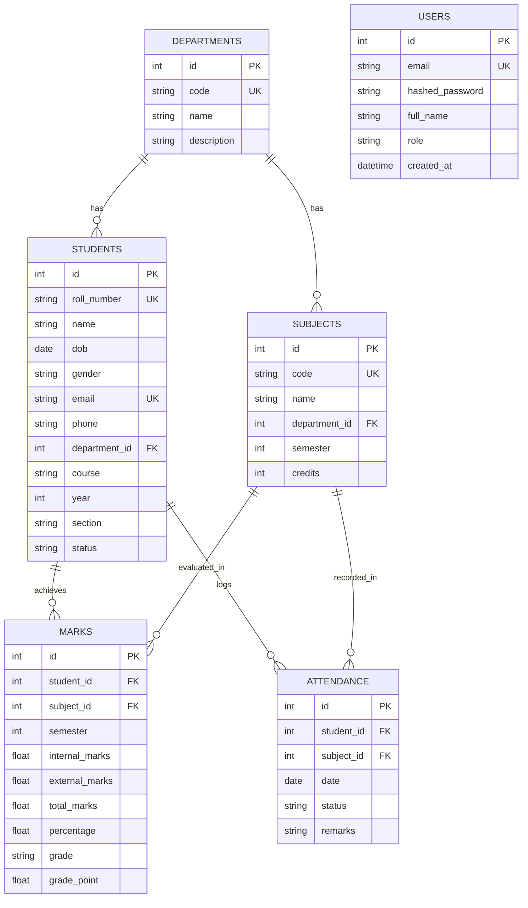

# 🎓 Student Management System (College Academic & Attendance Portal)

A full-stack, production-grade **Student Management System** built with **Python, FastAPI, SQLAlchemy, SQLite/PostgreSQL, and Vanilla JavaScript (ES6)**. Designed to centralize student registration, academic performance tracking, CGPA calculation, attendance monitoring, interactive dashboard analytics, and official PDF report card generation.

---

## 🌟 Key Features

### 1. 📋 Student Demographics & Management
- **Complete Profile Tracking**: Roll Number/Student ID, Name, Date of Birth, Gender, Email, Phone, Address, Department, Course, Academic Year (1-4), Section (A/B/C).
- **CRUD Operations**: Add, View, Filter, Search, Update, and Soft/Hard Delete student records.
- **Strict Duplicate Validations**: Backend & Database unique constraints prevent duplicate Roll Numbers or Email addresses with clean `HTTP 400` validation responses.

### 2. 📊 Academic Records & CGPA Calculator
- **Marks Management**: Store internal (40 max) and external (70 max) exam marks per subject per semester.
- **Automated Grade & CGPA Engine**: Auto-computes Total Marks, Percentage, Letter Grade (`A+`, `A`, `B`, `C`, `D`, `F`), and 10-point Scale Grade Points (`10.0` - `0.0`).
- **Semester Breakdown**: View semester-by-semester transcript performance and cumulative pass/fail status.

### 3. 🗓️ Attendance Tracking & Shortage Alerts
- **Class Attendance Logging**: Record daily class attendance status (`Present`, `Absent`, `Late`) with optional remarks.
- **Subject-Wise Analytics**: Compute subject-wise attendance percentages and overall compliance rates.
- **Low Attendance Warnings**: Automated visual alerts for students falling below the mandatory **75% threshold**.

### 4. 📈 Interactive Analytics Dashboard
- **Live Metric Cards**: Total registered students, average college CGPA, overall attendance rate, and active departments count.
- **Interactive Charts (Chart.js)**: Doughnut chart for department distribution and bar chart for academic year breakdown.
- **Top Performers Leaderboard**: Displays top 5 highest-ranking students sorted by CGPA.

### 5. 📑 PDF Report Card Generator
- **Server-Side PDF Generation**: Built with **ReportLab** to generate official, downloadable academic transcripts with college headers, grade summaries, attendance breakdowns, and verification signature fields.

### 6. 🔐 JWT Authentication & Security
- **Secure Password Hashing**: Utilizes `bcrypt` salt hashing.
- **Bearer Token Auth**: Protects administrative endpoints with JSON Web Tokens (JWT).
- **One-Click Demo Fill**: Clickable login shortcut for instant recruiter testing.

---

## 🛠️ Technology Stack

- **Backend**: Python 3.14+, FastAPI, Pydantic V2, SQLAlchemy 2.0 ORM, PyJWT, Bcrypt, ReportLab
- **Database**: SQLite (Default zero-config), compatible with PostgreSQL / MySQL via SQLAlchemy
- **Frontend**: HTML5, CSS3 Glassmorphism UI Design System, JavaScript (ES6 Modules/Fetch API), Chart.js, FontAwesome
- **Testing**: Pytest, HTTPX TestClient

---

## 🗄️ Database Architecture & Schema



---

## 🔌 REST API Endpoints

| Category | Method | Endpoint | Description | Auth Required |
| :--- | :--- | :--- | :--- | :---: |
| **Auth** | `POST` | `/api/v1/auth/login` | Authenticate user & obtain JWT token | ❌ |
| **Auth** | `GET` | `/api/v1/auth/me` | Fetch authenticated user profile | ✅ |
| **Students** | `GET` | `/api/v1/students` | List students (filters: `department_id`, `year`, `search`) | ❌ |
| **Students** | `POST` | `/api/v1/students` | Register new student with roll/email validation | ✅ |
| **Students** | `GET` | `/api/v1/students/{id}` | Get full profile + CGPA & attendance stats | ❌ |
| **Students** | `PUT` | `/api/v1/students/{id}` | Update student information | ✅ |
| **Students** | `DELETE` | `/api/v1/students/{id}` | Delete student record | ✅ |
| **Academics** | `POST` | `/api/v1/marks` | Record subject marks (auto-computes grade/GP) | ✅ |
| **Academics** | `GET` | `/api/v1/marks/students/{id}` | Retrieve all subject marks for student | ❌ |
| **Attendance** | `POST` | `/api/v1/attendance` | Log daily subject attendance | ✅ |
| **Attendance** | `GET` | `/api/v1/attendance/students/{id}` | Get subject-wise attendance breakdown | ❌ |
| **Dashboard**| `GET` | `/api/v1/dashboard/stats` | Retrieve aggregate KPIs, charts, top performers | ❌ |
| **Reports** | `GET` | `/api/v1/reports/students/{id}/pdf` | Download official ReportLab PDF report card | ❌ |

---

## 📂 Project Folder Structure

```
StudentManagementSystem/
│
├── backend/
│   ├── app/
│   │   ├── core/           # Config, database engine, security JWT handlers
│   │   ├── models/         # SQLAlchemy ORM models (User, Student, Department, Subject, Mark, Attendance)
│   │   ├── schemas/        # Pydantic V2 validation schemas
│   │   ├── routes/         # REST API route handlers
│   │   └── services/       # Academic calculation service & ReportLab PDF generator
│   ├── seed.py             # Realistic college data seeder script
│   └── main.py             # FastAPI entrypoint & static frontend server
│
├── frontend/
│   ├── css/
│   │   └── styles.css      # Glassmorphic slate CSS design system
│   ├── js/
│   │   └── app.js          # SPA state management, Chart.js analytics & API caller
│   └── index.html          # Interactive Single-Page Application (SPA)
│
├── tests/                  # Pytest unit tests suite
│   ├── test_auth.py
│   ├── test_students.py
│   ├── test_academics.py
│   └── test_attendance.py
│
├── requirements.txt        # Backend dependencies
├── .env.example            # Environment configuration template
├── .gitignore              # Git ignore rules
├── run.py                  # One-click zero-config local launcher
└── README.md               # Project documentation
```

---

## ⚡ Quickstart & Installation

### 1. Clone the Repository
```bash
git clone https://github.com/your-username/StudentManagementSystem.git
cd StudentManagementSystem
```

### 2. Install Dependencies
```bash
python -m pip install -r requirements.txt
```

### 3. Run the Application
Execute the one-click launcher script:
```bash
python run.py
```

The script will automatically initialize the database, seed realistic college data, and boot the server at:
- **Web Portal**: [http://127.0.0.1:8000](http://127.0.0.1:8000)
- **Interactive API Docs (Swagger UI)**: [http://127.0.0.1:8000/docs](http://127.0.0.1:8000/docs)
- **ReDoc Documentation**: [http://127.0.0.1:8000/redoc](http://127.0.0.1:8000/redoc)

### 4. Demo Login Credentials
- **Email**: `admin@college.edu`
- **Password**: `admin123`

---

## 🧪 Running Automated Unit Tests

Execute `pytest` to run the test suite covering authentication, student validation, CGPA calculations, and attendance tracking:
```bash
python -m pytest tests/ -v
```

---

## 🚀 GitHub & Deployment Guide

### Push to GitHub
```bash
git init
git add .
git commit -m "Initial commit: Complete Student Management System"
git branch -M main
git remote add origin https://github.com/your-username/StudentManagementSystem.git
git push -u origin main
```

### Deploying to Render / Railway / Heroku
1. Set the Start Command: `uvicorn backend.main:app --host 0.0.0.0 --port $PORT`
2. Set Environment Variables:
   - `DATABASE_URL`: Your PostgreSQL / MySQL connection string
   - `SECRET_KEY`: A strong secure secret key string

---

## 💼 Resume Bullet Points

- **Full-Stack Student Management System**: Designed and implemented a modular Student Management System using **FastAPI, SQLAlchemy, and JavaScript**, managing student demographics, academic marks, and attendance records for 5+ college departments.
- **RESTful Architecture & Validation Engine**: Engineered 13+ RESTful API endpoints with Pydantic V2 request validation, handling duplicate Roll Number and Email constraints with custom exception handling and HTTP status codes.
- **Automated CGPA & Report Card Generation**: Developed an academic service computing 10-point scale CGPA and letter grades, integrated with **ReportLab** for dynamic, server-side PDF transcript downloading.
- **Interactive Glassmorphic Analytics Dashboard**: Built a responsive Single-Page Application (SPA) dashboard utilizing **Chart.js** for real-time visualization of department metrics, grade distributions, and automated 75% attendance shortage alerts.
