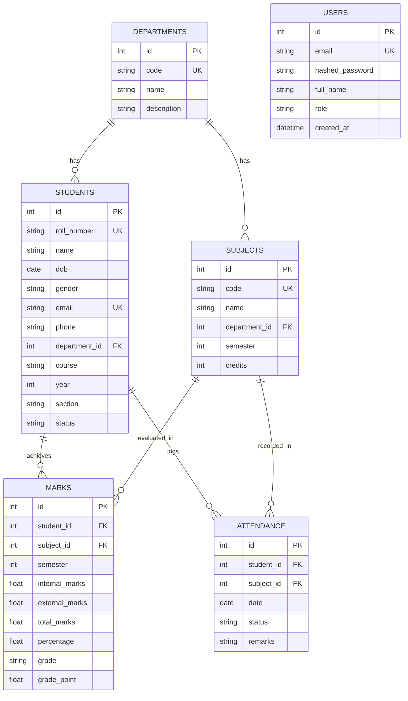

# 🎓 Student Management System (College Academic & Attendance Portal)

A full-stack **Student Management System** built with **Python, FastAPI, SQLAlchemy 2.x, SQLite, and Vanilla JavaScript (ES6)**. Designed to centralize student registration, academic performance tracking, CGPA calculation, attendance monitoring, interactive dashboard analytics, student self-service portal, role-based access control, and official PDF report card generation.

---

## 🌟 Key Features

### 1. 📋 Student Demographics & Management
- **Complete Profile Tracking**: Roll Number/Student ID, Name, Date of Birth, Gender, Email, Phone, Address, Department, Course, Academic Year (1-4), Section (A/B/C).
- **CRUD Operations**: Add, View, Filter, Search, Update, and Delete student records (Admin restricted for modifications).
- **Strict Duplicate Validations**: Backend & Database unique constraints prevent duplicate Roll Numbers or Email addresses with clean `HTTP 400` validation responses.

### 2. 📊 Academic Records & Consistent CGPA Calculator
- **Standardized Marks Model**: Internal exam marks (Max 30) and external exam marks (Max 70) per subject per semester, adding up to a total of 100 marks per subject.
- **Automated Grade & CGPA Engine**: Auto-computes Total Marks, Percentage, Letter Grade (`A+`, `A`, `B`, `C`, `D`, `F`), and 10-point Scale Grade Points (`10.0` - `0.0`).
- **Semester Breakdown**: View semester-by-semester transcript performance and cumulative pass/fail status.

### 3. 🗓️ Attendance Tracking & Shortage Alerts
- **Class Attendance Logging**: Record daily class attendance status (`Present`, `Absent`, `Late`) with optional remarks.
- **Subject-Wise Analytics**: Compute subject-wise attendance percentages and overall compliance rates.
- **Low Attendance Warnings**: Automated visual alerts for students falling below the mandatory **75% threshold**.

### 4. 👤 Dedicated Student Self-Service Portal
- **Student Dashboard**: Dedicated view for student users displaying personal profile, semester GPAs, overall CGPA, subject marks, and attendance breakdown.
- **Self-Access Isolation**: Enforces backend privacy checks ensuring student users can only access their own profile, marks, attendance, and transcript PDF.
- **Attendance Shortage Banner**: Prominent visual warning alert if a student's attendance drops below 75%.

### 5. 🔑 Real Role-Based Access Control (RBAC) & Endpoint Security
- **Admin**: Full permissions across Students, Departments, Subjects, Marks, Attendance, Reports, and Dashboard.
- **Faculty**: Manage Marks & Attendance, view Students, Departments, Subjects, Reports, and Dashboard stats.
- **Student**: View only their own profile, marks, CGPA, attendance, and transcript PDF.
- **JWT Authentication & Environment Security**: Password salt hashing via `bcrypt`, Bearer JWT access tokens, dynamic `CORS_ORIGINS` configuration, and environment variable support (`.env`).

### 6. 📈 Interactive Analytics Dashboard
- **Live Metric Cards**: Total registered students, average college CGPA, overall attendance rate, and active departments count.
- **Interactive Charts (Chart.js)**:
  - Department distribution (doughnut chart)
  - Academic year breakdown (bar chart)
  - Semester GPA trend (line chart)
  - Subject attendance percentage (bar chart)
- **Top Performers Leaderboard**: Displays top 5 highest-ranking students sorted by CGPA.

### 7. 📑 PDF Report Card Generator
- **Server-Side PDF Generation**: Built with **ReportLab** to generate official, downloadable academic transcripts with college headers, grade summaries, attendance breakdowns, and verification signature fields.

---

## 🛠️ Technology Stack

- **Backend**: Python 3.14+, FastAPI, Pydantic V2, SQLAlchemy 2.0 ORM, PyJWT, Bcrypt, ReportLab
- **Database**: SQLite (Default zero-config), compatible with PostgreSQL / MySQL via SQLAlchemy
- **Frontend**: HTML5, Vanilla CSS Glassmorphism UI System, JavaScript (ES6 Fetch API), Chart.js, FontAwesome
- **Testing**: Pytest, HTTPX TestClient

---

## 🗄️ Database Architecture & Schema



---

## 🔌 REST API Endpoints & Role Permissions

| Category | Method | Endpoint | Description | Auth Required | Allowed Roles |
| :--- | :--- | :--- | :--- | :---: | :---: |
| **Auth** | `POST` | `/api/v1/auth/login` | Authenticate user & obtain JWT token | ❌ | All |
| **Auth** | `POST` | `/api/v1/auth/register` | Register new user account | ❌ | All |
| **Auth** | `GET` | `/api/v1/auth/me` | Fetch authenticated user profile | ✅ | Admin, Faculty, Student |
| **Students** | `GET` | `/api/v1/students` | List students with filters | ✅ | Admin, Faculty |
| **Students** | `POST` | `/api/v1/students` | Create student record | ✅ | Admin |
| **Students** | `GET` | `/api/v1/students/me/profile` | Get current logged-in student profile | ✅ | Student |
| **Students** | `GET` | `/api/v1/students/{id}` | Get student profile details | ✅ | Admin, Faculty, Student (Self) |
| **Students** | `PUT` | `/api/v1/students/{id}` | Update student record | ✅ | Admin |
| **Students** | `DELETE` | `/api/v1/students/{id}` | Delete student record | ✅ | Admin |
| **Departments**| `GET` | `/api/v1/departments` | List departments | ✅ | Admin, Faculty, Student |
| **Departments**| `POST` | `/api/v1/departments` | Create department | ✅ | Admin |
| **Subjects** | `GET` | `/api/v1/subjects` | List subjects | ✅ | Admin, Faculty, Student |
| **Subjects** | `POST` | `/api/v1/subjects` | Create subject | ✅ | Admin |
| **Academics** | `POST` | `/api/v1/marks` | Record or update marks | ✅ | Admin, Faculty |
| **Academics** | `GET` | `/api/v1/marks/students/{id}` | Retrieve student marks | ✅ | Admin, Faculty, Student (Self) |
| **Attendance** | `POST` | `/api/v1/attendance` | Log daily subject attendance | ✅ | Admin, Faculty |
| **Attendance** | `GET` | `/api/v1/attendance/students/{id}` | Get attendance breakdown | ✅ | Admin, Faculty, Student (Self) |
| **Dashboard**| `GET` | `/api/v1/dashboard/stats` | Retrieve aggregate KPIs & charts | ✅ | Admin, Faculty |
| **Reports** | `GET` | `/api/v1/reports/students/{id}/pdf` | Download official PDF transcript | ✅ | Admin, Faculty, Student (Self) |

---

## ⚙️ Environment Variables Configuration

Create a `.env` file in the root directory (based on `.env.example`):

```env
PROJECT_NAME="Student Management System"
SECRET_KEY="college-secret-key-super-secure-change-in-production"
ALGORITHM="HS256"
ACCESS_TOKEN_EXPIRE_MINUTES=1440

# Database Configuration
DATABASE_URL="sqlite:///./student_management.db"

# Attendance Threshold
MIN_ATTENDANCE_PERCENTAGE=75.0

# Security & CORS Settings
CORS_ORIGINS="http://localhost,http://127.0.0.1,http://localhost:8000,http://127.0.0.1:8000,http://localhost:8050,http://127.0.0.1:8050"
```

---

## 📂 Project Folder Structure

```
StudentManagementSystem/
│
├── backend/
│   ├── app/
│   │   ├── core/           # Config, database engine, security JWT handlers
│   │   ├── models/         # SQLAlchemy ORM models (User, Student, Department, Subject, Mark, Attendance)
│   │   ├── schemas/        # Pydantic V2 validation schemas
│   │   ├── routes/         # REST API route handlers (Auth, Students, Departments, Subjects, Marks, Attendance, Dashboard, Reports)
│   │   └── services/       # Academic calculation engine & ReportLab PDF generator
│   ├── seed.py             # Database schema seeder script
│   └── main.py             # FastAPI entrypoint & static web server
│
├── frontend/
│   ├── css/
│   │   └── styles.css      # Glassmorphic UI CSS styling system
│   ├── js/
│   │   └── app.js          # SPA state management, Chart.js analytics & API integration
│   └── index.html          # Single-Page Application (SPA) dashboard
│
├── tests/                  # Automated Pytest suite
│   ├── test_auth.py
│   ├── test_students.py
│   ├── test_academics.py
│   ├── test_attendance.py
│   └── test_roles.py       # RBAC, privacy isolation, input validation, and PDF tests
│
├── .env                    # Active environment variables file
├── .env.example            # Environment template
├── requirements.txt        # Backend python dependencies
├── run.py                  # Zero-config local application launcher
└── README.md               # System documentation
```

---

## ⚡ Quickstart & Installation

### 1. Clone the Repository
```bash
git clone https://github.com/your-username/StudentManagementSystem.git
cd StudentManagementSystem
```

### 2. Install Dependencies
```bash
python -m pip install -r requirements.txt
```

### 3. Run the Application
Execute the one-click launcher script:
```bash
python run.py
```

The script automatically initializes the database schema, seeds realistic sample data, and launches the server:
- **Web Portal**: [http://127.0.0.1:8000](http://127.0.0.1:8000)
- **Interactive API Docs (Swagger UI)**: [http://127.0.0.1:8000/docs](http://127.0.0.1:8000/docs)
- **ReDoc Documentation**: [http://127.0.0.1:8000/redoc](http://127.0.0.1:8000/redoc)

### 4. Demo Accounts
- **Admin**: Email `admin@college.edu` | Password `admin123`
- **Faculty**: Email `faculty@college.edu` | Password `faculty123`
- **Student**: Email `aarav.sharma@college.edu` | Password `student123`

---

## 🧪 Automated Testing

Run the complete Pytest suite covering authentication, role authorization, student self-access privacy, marks calculation, attendance validation, PDF report generation, and dashboard statistics:

```bash
python -m pytest -v
```

### Test Suite Results:
- **Total Test Cases**: `31`
- **Passed**: `31 / 31` (100% Pass Rate)
- **Test Modules**: `test_auth.py`, `test_students.py`, `test_academics.py`, `test_attendance.py`, `test_roles.py`
